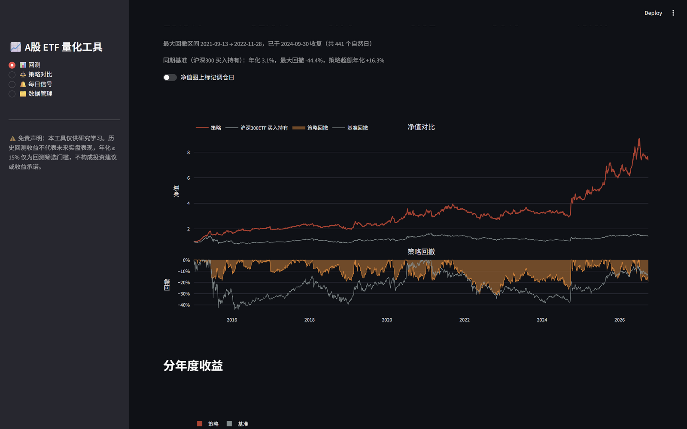
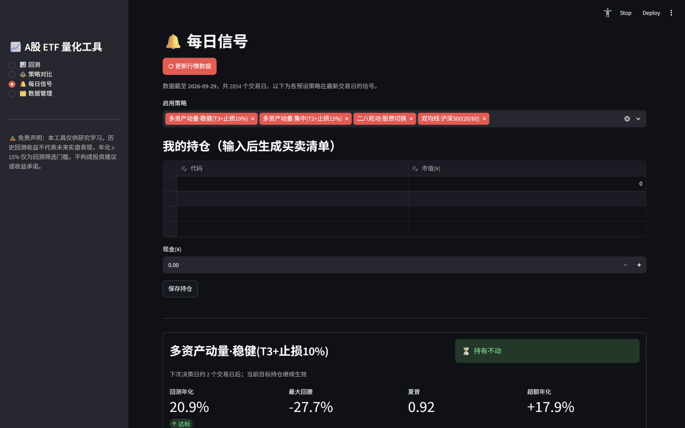

# A股 ETF 量化工具（回测 + 每日信号）

> **A-share ETF momentum rotation toolkit**: backtesting, strategy comparison and daily
> trading signals for liquid Chinese & cross-border ETFs. Pure local Python, free data
> sources, no account/token required. **For research and study only — not investment advice.**

本地面量化研究工具：用历史数据回测 ETF 轮动策略，并以「回测年化 ≥ 15%」为门槛
筛选策略；每天运行生成买卖信号，手动下单执行。Web 界面基于 Streamlit。

> ⚠️ **重要声明（请先阅读）**
>
> - 本项目仅供**学习与研究**，**不构成任何投资建议**，**不提供投资顾问服务**，
>   **不作任何收益承诺**；文中出现的回测数字（如年化 20.9%）均为历史数据回放结果。
> - 历史回测不代表未来实盘表现；据此操作，风险自负。
> - 行情数据来自腾讯、东方财富公开接口，版权归原作者/平台所有，请勿高频请求。

**新手请先读 [操作说明书.md](操作说明书.md)**——从第一次启动到首次建仓、
每日操作的完整步骤都在里面。





> ⚠️ **重要免责声明**
> 1. 任何工具都无法**保证**年化 15% 以上的收益。本工具中的 15% 是**历史回测的
>    筛选门槛**，不是承诺。回测收益不代表未来实盘表现。
> 2. 本工具仅供研究学习，不构成投资建议。据此实盘操作，风险自负。

## 功能

| 页面 | 说明 |
|---|---|
| 📊 回测 | 选策略/参数/区间 → 净值 vs 沪深300 对比图、回撤图、年化/回撤/夏普/卡玛/胜率、15% 门槛判定、分年度收益、月度收益热力图、滚动 1 年年化、调仓明细（可导出 CSV）；支持「信号日收盘 / 次日开盘」两种成交口径 |
| ⚖️ 策略对比 | 批量回测多组参数并排名；年化-回撤散点图；样本内/外切分检查过拟合 |
| 🔔 每日信号 | 一键更新数据 → 各策略今日目标持仓 + 回测指标卡；数据过期自动提醒；输入当前持仓后生成买卖清单（±0.5% 以内不动）；信号可记录到 signals_log.csv 留档复盘 |
| 🗂️ 数据管理 | ETF 池增删改、数据覆盖情况、全量刷新/重建缓存 |

## 安装与启动

**方式一：双击运行（推荐）**

| 文件 | 作用 |
|---|---|
| `安装依赖.bat` | 首次使用跑一次：安装全部依赖（阿里云镜像） |
| `启动量化工具.bat` | 双击启动 Web 界面，浏览器自动打开 http://localhost:8501；关闭窗口即退出 |
| `每日信号.bat` | 双击更新数据并打印今日信号（收盘后运行，可配 Windows 计划任务） |
| `运行自检.bat` | 引擎数值自检（与手算对照），怀疑结果异常时先跑它 |
| `备份打包.bat` | 生成 `量化工具_备份_日期.zip`（代码+行情+配置），可拷到其他电脑 |

**方式二：命令行**

```bash
pip install -r requirements.txt -i https://mirrors.aliyun.com/pypi/simple/
python -m streamlit run app.py        # Web 界面
python run_daily.py                   # 每日信号（命令行版）
```

每日操作流程：**收盘后**（建议 19:00 行情数据稳定后）运行信号页或
`每日信号.bat` → 按操作清单在下一交易日开盘执行。

## 内置策略

**多资产动量轮动**（主策略，两个预设）：
- 池 = 宽基（沪深300/中证500/创业板/中证1000/科创50）+ 红利 + 黄金 + 国债 +
  跨境（**纳指/标普500/中概互联/恒生科技**）共 12 只
  （刻意剔除行业 ETF——A 股行业动量反转剧烈，回测中显著拖累收益）
- 每 5 个交易日取过去 20 日涨幅最高的 2~3 只等权持有
- **双动量**（Antonacci GEM）：动量须跑赢国债 ETF 自身动量才入选，否则持国债
- **持仓动态止损**：持有期内从最高收盘回撤超过 10%~15% 立即切国债，防止崩盘绞杀
- 回测（2015-01 至 2026-09，单边成本万3，收盘成交）：

| 预设 | 年化 | 最大回撤 | 夏普 | 月胜率 | 换手/年 |
|---|---|---|---|---|---|
| 多资产动量·稳健(T3+止损10%) | 20.9% | -27.7% | 0.92 | 61% | 43x |
| 多资产动量·集中(T2+止损15%) | 22.2% | -35.6% | 0.85 | 60% | 43x |
| 二八轮动·股债切换（对照） | 10.8% | -31.8% | 0.50 | 54% | 66x |
| 双均线·沪深300（对照） | -0.4% | -32.8% | — | 28% | 10x |

- 沪深300 买入持有同期年化约 3.2%、回撤 -44%
- 样本内外（2021-01 切分）：稳健版样本内 21.9% / 样本外 19.6%，较为接近
- **跨境标的的两点提醒**：① 加入纳指等美股资产显著改善了 2021-2026 段表现，
  但这段包含美股大牛市，美股转熊时策略会自动切走（双动量+止损），收益会回落；
  ② QDII ETF 存在**溢价风险**（市价远高于净值时买入会承受溢价崩塌），实盘
  执行前务必按《操作说明书》3.5 节检查溢价。

**二八轮动·股债切换**（教科书经典，作为对照）：300 vs 500 二选一，弱市持国债。

**双均线·沪深300(20/60)**（教科书经典，作为对照）：金叉持有、死叉清仓。

## 回测口径（杜绝自欺）

- 信号在 T 日收盘产生，按所选口径成交：**信号日收盘**（行业惯例）或
  **次日开盘**（更贴近收盘看信号、次日开盘下单的实盘流程；当前参数下两种
  口径年化差异在 ±0.5 个点内，可任选，次日开盘更接近真实可得收益）
- 调仓之间持仓随行情漂移；成本 = 单边换手 ×（佣金+滑点）实时扣减净值
- 复权数据含分红再投资；拆分/折算已平滑
- **成本敏感性必须知道**：动量类策略年化换手约 40 倍，成本每增加万 2/边，
  年化约降 1 个百分点。默认假设单边万3（佣金万1+冲击万2，适合高流动性 ETF+
  低佣券商）；若你的佣金更高，请在回测页调高滑点再看待达标结论。
- 策略引擎数值经过手算对照自检：`python selfcheck.py`（含收盘/次日开盘/
  漂移/子池止损等 9 类场景）
- 界面功能测试：`python test_app.py`

## 数据

- 主源：腾讯行情接口（免费）；备源：东方财富（akshare）。均无需 token
- 本地缓存为 parquet（`data/` 目录），每次**全量刷新**——复权序列在分红后
  会被重新缩放，增量拼接会造成锚点断裂，故不做增量更新（12 只 ETF 约 1 分钟）
- 若本机安全软件（如奇安信天擎）拦截行情接口，工具会自动切到备用源；
  两个源都失败时请检查安全软件的上网管控策略
- 已知限制：复权价保留 3 位小数，日收益率约有 ±0.03% 的量化噪声，对结果影响很小

## 二次开发

- 改动 `quant/` 引擎或策略后，请先跑 `python selfcheck.py`（数值手算对照）
  和 `python test_app.py`（界面交互），CI 会在 push 时自动执行 selfcheck
- 批处理文件为 GBK 编码（Windows 中文 cmd 标准），修改时保持 GBK+CRLF
- 欢迎 issue/PR；本项目由作者业余维护，按"现状"提供，不承诺响应时效

## 文件结构

```
启动量化工具.bat   双击启动 Web 界面
每日信号.bat       双击更新数据+打印信号
运行自检.bat       双击引擎自检
安装依赖.bat       首次安装依赖（阿里云镜像）
备份打包.bat       打包成 zip 便携备份（可拷到其他电脑）
app.py            Streamlit 界面入口
run_daily.py      命令行每日信号
selfcheck.py      策略/引擎数值自检（手算对照，9 类场景）
test_app.py       界面功能测试（Streamlit AppTest）
config.py         ETF 池、成本、15% 门槛等配置
.streamlit/       Streamlit 服务配置（端口/主题）
quant/
  data.py         数据下载/缓存（腾讯主源+东财备源）
  strategies.py   策略信号（动量轮动/双动量/止损/双均线，numpy 实现）
  backtest.py     回测引擎（收盘/次日开盘两种成交口径）
  metrics.py      绩效指标
  signals.py      每日信号与持仓差额
data/             行情缓存（parquet）
user_config.json  界面里保存的 ETF 池与当前持仓
signals_log.csv   信号历史日志（信号页手动记录）
```

> 批处理文件为 GBK 编码（Windows 中文 cmd 标准），用编辑器修改时注意
> 保持 GBK+CRLF，否则中文会乱码或解析失败。

## 已知边界

- 不支持实盘自动下单；信号需手动执行
- 回测为日频收盘价撮合，未建模盘中波动、涨跌停无法成交、大额冲击
- 参数扫描结果（尤其样本内）存在过拟合风险，请务必用「策略对比」页的
  样本内/外切分自行检验后再相信任何一组参数
